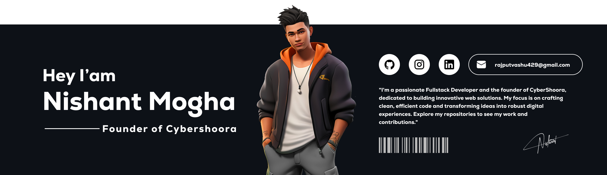

# Hello World!, I'm Nishant, a Indian Developer 👋🏼:

# 💫 About Me:
👋 Hey there! I'm a passionate freelancer who thrives in the world of coding and development 🚀. With expertise across a variety of programming languages like HTML, CSS, JavaScript, Python, Dart, Java, and many more, I bring creative solutions to life through my diverse skill set 💻.  🌟 I'm also working on building my own company, Cyber Shorr, where innovation meets cutting-edge technology. With a strong vision of shaping the future of the IT sector, Cyber Shorr is set to make waves in the digital world 🌐.  🤝 I'm lucky to have an amazing team that makes it all possible: 
<b>Kanan Singh</b> – The problem-solving wizard ⚡ <be>   <b>Harshit</b> – The design and architecture guru 🎨 <be>   <b>Meghna</b> – The coding prodigy 🔥<be>   Together, we work tirelessly to deliver exceptional projects and build solutions that help businesses grow and thrive 📈. We're committed to taking on challenges, building amazing tech products, and continuously evolving in this fast-paced industry.  If you’re looking to collaborate or want to see some of our awesome work, feel free to check out my repositories below or reach out directly! 😄 Let's make something incredible together. ✨  

## 🌐 Socials:
   

# 💻 Tech Stack:
                                                        
# 📊 GitHub Stats:
 
 

## 🏆 GitHub Trophies

### ✍️ Random Dev Quote

### 🔝 Top Contributed Repo

<h2>Contributions</h2>

---

<!-- Proudly created with GPRM ( https://gprm.itsvg.in ) -->

<picture>
  <source media="(prefers-color-scheme: dark)" srcset="https://raw.githubusercontent.com/tobiasmeyhoefer/tobiasmeyhoefer/output/github-snake-dark.svg" />
  <source media="(prefers-color-scheme: light)" srcset="https://raw.githubusercontent.com/tobiasmeyhoefer/tobiasmeyhoefer/output/github-snake.svg" />
  
</picture>
